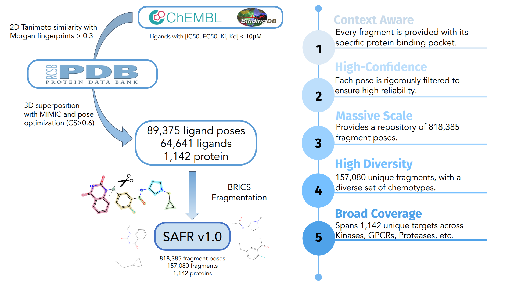

# SAFR: Structurally Anchored Fragment Repository

This repository contains the source code, validation workflows, and case studies for the SAFR methodology. SAFR is a knowledge-extractive approach designed to generate high-fidelity fragment pose hypotheses from bioactive ligand data.

## Overview

The analysis is organized into two primary phases: methodological validation against established benchmarks (PDBbind v2020) and a comprehensive analysis of the generated SAFR library.




## Citation

This repository is complementary to the following publication:

> Joan Cabot-March, Xavier Jalencas, and Jordi Mestres. **SAFR: Enabling Fragment-Based Drug Discovery with a Synthetic Binding Pose Dataset.** *TO BE PUBLISHED.* 2026.

## Data Availability

While this GitHub repository contains the code and processing workflows, the full **SAFR v1.0** (including all 818,385 fragment-protein interactions) alongside the **Crystal Fragments set**  is hosted on Zenodo for long-term archival:

**Zenodo Repository:** [https://zenodo.org/records/18229523](https://zenodo.org/records/18229523)

## Repository Structure

* `Validation.ipynb`: Core notebook for methodological validation. Reproduces success rate calculations, etc.
* `SAFR_Analysis.ipynb`: Notebook for library-wide metrics, including comparison with the Crystal dataset and fragment property distributions.
* `bioisosteres/`: **Case Study 1**. Contains the dedicated notebook and structural data for bioisosteric replacement analysis.
* `scaffold_hopping/`: **Case Study 2**. Contains the notebook and data demonstrating SAFR's application in scaffold hopping.
* `rmsd_validation/`: Raw data and scripts for the RMSD benchmarking against rDock and Boltz2.
* `Fragment_Validation/`: Supplementary data regarding the Fragment level validation against mPRO fragment screenings.
* `Data/`: All processed `.csv` files required to run the notebooks.
* `Images/`: High-resolution versions of the plots generated by the notebooks.

## Installation & Requirements

To reproduce the analysis, we recommend using a Conda environment:

```bash
git clone [https://github.com/chemotargets/SAFR.git](https://github.com/chemotargets/SAFR.git)
cd SAFR
conda env create -f environment.yml
conda activate SAFR
```